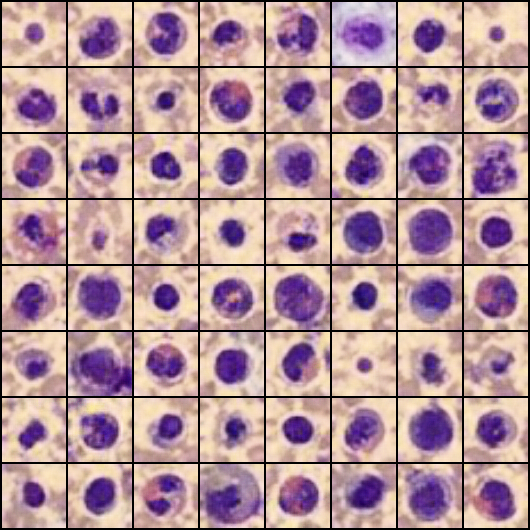

# GAN‑Based Blood Cell Synthesis on BloodMNIST

<!-- PROJECT LOGO -->
<p align="center">
  
</p>

**Compare three GAN loss functions (LSGAN, WGAN, WGAN‑GP) on the BloodMNIST dataset and evaluate using Inception Score & FID.**

---

## Table of Contents

- [Project Description](#project-description)  
- [Dataset](#dataset)  
- [Environment & Installation](#environment--installation)  
- [Usage](#usage)  
- [Directory Structure](#directory-structure)  
- [Results](#results)  
- [Hyperparameters](#hyperparameters)  
- [Notes & Future Work](#notes--future-work)  
- [References](#references)  

---

## Project Description

Generative Adversarial Networks (GANs) have emerged as a powerful tool for synthesizing realistic images. In this project, we:

1. **Implement three GAN variants**  
   - **LSGAN** (Least Squares GAN)  
   - **WGAN** (Wasserstein GAN with weight clipping)  
   - **WGAN‑GP** (WGAN with Gradient Penalty)  

2. **Train each model** on the BloodMNIST subset of the MedMNIST collection for **50 epochs**, saving model checkpoints and generated image grids every 10 epochs.

3. **Evaluate** the quality and diversity of the generated blood‑cell images using:  
   - **Inception Score (IS)**  
   - **Fréchet Inception Distance (FID)**  

4. **Visualize** final generated samples side‑by‑side for qualitative comparison.

---

## Dataset

We use **BloodMNIST**, part of the [MedMNIST](https://medmnist.com/) benchmark:

| Property            | Details                                                                             |
|:--------------------|:------------------------------------------------------------------------------------|
| Origin              | MedMNIST: A large-scale lightweight benchmark for 2D biomedical image analysis       |
| BloodMNIST link     | https://medmnist.com/                                                                 |
| Task                | 8‑way classification of blood cell types (neutrophil, eosinophil, …)                  |
| Image size          | 28×28 grayscale (converted to 3‑channel 64×64 for GAN training)                       |
| Train / Test split  | 17,092 / 4,273 images                                                                  |

The code automatically downloads BloodMNIST via the `medmnist` Python package.

---

## Environment & Installation

1. **Clone this repository**  
   ```bash
   git clone https://github.com/your‑username/gan-bloodmnist.git
   cd gan-bloodmnist
